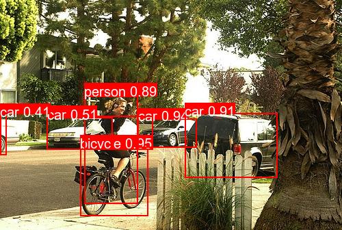

# VOC-VOLO-V8: 基于 YOLO V8 的 PASCAL VOC 2007 目标检测项目



<video controls width="100%">
  <source src="predict/pred2.mp4" type="video/mp4">
  你的浏览器不支持视频标签。
</video>
## 项目简介

**VOC-VOLO-V8** 是一个基于 YOLO V8 对VOC 2007的目标检测项目，专注于 PASCAL VOC 2007 数据集的处理、训练和预测。该项目通过将 PASCAL VOC 2007 数据集转换为 YOLO 格式，并利用 YOLO V8 模型进行训练，实现了高效的目标检测任务。

## 数据集

### PASCAL VOC 2007 数据集
PASCAL VOC 2007 是计算机视觉领域中一个著名的标准数据集，包含 9963 张图片，分为训练集（5011 张）和测试集（4952 张），涵盖 20 个类别，如飞机、自行车、鸟、船、瓶子等。其标注信息以 XML 格式存储，包含目标的边界框和类别标签。

### 数据集处理
项目中提供了以下功能：
1. **下载数据集**：从官方 URL 下载 PASCAL VOC 2007 数据集。
2. **格式转换**：将原始的 VOC 格式（XML）转换为 YOLO 格式（TXT），包括边界框和类别标签的标准化。
3. **数据集划分**：将数据集划分为训练集和测试集，并生成 `voc.yaml` 配置文件。

### 数据集下载
```python
# 下载并解压数据集
download_and_extract(VOC_URL, DATA_DIR)
download_and_extract(VOC_TEST_URL, DATA_DIR)
```

## 环境依赖

### Python 环境
- Python 3.8 或更高版本
- PyTorch 1.10 或更高版本（推荐使用 CUDA 支持）
- Ultralytics YOLO 8.3.108 或更高版本

### 安装依赖
```bash
pip install ultralytics
```

## 项目结构

```
VOC-VOLO-V8/
├── baseModel/           # 预训练模型
├── dataset/             # 数据集存储目录
│   ├── output/          # 转换后的 YOLO 格式数据集
│   └── voc.yaml         # 数据集配置文件
├── predict/             # 预测结果保存目录
├── runs/                # 训练结果保存目录
├── .gitignore           # Git 忽略文件
├── datasetDownLoad.py   # 数据集下载和转换脚本
├── model_train_predict_ultralytics.ipynb  # 训练和预测代码
├── README.MD            # 项目说明
└── voc.yaml             # 数据集配置文件
```

## 使用方法

### 1. 数据集下载与转换
运行以下代码下载 PASCAL VOC 2007 数据集并转换为 YOLO 格式：
```python
# 下载并解压数据集
download_and_extract(VOC_URL, DATA_DIR)
download_and_extract(VOC_TEST_URL, DATA_DIR)

# 转换 VOC 格式到 YOLO 格式
convert_voc_to_yolo(DATA_DIR, DATA_DIR + "/output")
```

### 2. 模型训练
加载预训练模型并开始训练：
```python
# 加载预训练模型
model = YOLO("baseModel/yolov8n.pt")

# 训练模型
model.train(
    data="voc.yaml",
    epochs=30,
    batch=64,
    imgsz=800,
    device="cuda",
    optimizer="AdamW",
    lr0=0.0001,
    augment=True,
    save=True,
    exist_ok=True
)
```

### 3. 模型预测
运行以下代码进行预测：
```python
# 预测图片
run_predict("dataset/output/images/test/000001.jpg", save=True, save_path="predict/")

# 预测视频
run_predict("dataset/output/video.mp4", save=True, save_path="predict/")

# 预测文件夹
run_predict("dataset/output/images/test/", save=True, save_path="predict/")

# 摄像头实时预测
run_predict(0)
```

## 性能评估

### 模型性能
训练完成后，模型在 PASCAL VOC 2007 测试集上的性能如下：
| 指标          | 值       |
|---------------|----------|
| mAP50         | 0.925    |
| mAP50-95      | 0.734    |
| 每张图片推理时间 | 7.5ms    |

### 各类别性能
| 类别          | Precision | Recall | mAP50 | mAP50-95 |
|---------------|-----------|--------|-------|----------|
| aeroplane     | 0.972     | 0.921  | 0.983 | 0.812    |
| bicycle       | 0.920     | 0.871  | 0.948 | 0.741    |
| bird          | 0.869     | 0.880  | 0.937 | 0.719    |
| boat          | 0.870     | 0.779  | 0.876 | 0.648    |
| bottle        | 0.836     | 0.748  | 0.835 | 0.579    |
| bus           | 0.919     | 0.908  | 0.955 | 0.830    |
| car           | 0.904     | 0.856  | 0.943 | 0.745    |
| cat           | 0.939     | 0.928  | 0.969 | 0.851    |
| chair         | 0.868     | 0.701  | 0.836 | 0.616    |
| cow           | 0.911     | 0.866  | 0.951 | 0.740    |
| diningtable   | 0.898     | 0.781  | 0.894 | 0.711    |
| dog           | 0.937     | 0.922  | 0.972 | 0.832    |
| horse         | 0.925     | 0.921  | 0.962 | 0.809    |
| motorbike     | 0.881     | 0.859  | 0.927 | 0.732    |
| person        | 0.922     | 0.846  | 0.945 | 0.725    |
| pottedplant   | 0.850     | 0.710  | 0.835 | 0.561    |
| sheep         | 0.903     | 0.866  | 0.925 | 0.668    |
| sofa          | 0.885     | 0.745  | 0.885 | 0.746    |
| train         | 0.973     | 0.936  | 0.973 | 0.837    |
| tvmonitor     | 0.924     | 0.877  | 0.948 | 0.771    |

## 参考资源

- [PASCAL VOC 2007 官方网站](http://host.robots.ox.ac.uk/pascal/VOC/voc2007/)
- [Ultralytics YOLO 官方文档](https://docs.ultralytics.com/)
```

### 关于数据集下载链接问题
由于网络原因，PASCAL VOC 2007 数据集的下载链接可能无法正常解析。如果遇到问题，请检查以下内容：
1.数据集[VOCtrainval_06-Nov-2007.tar](http://host.robots.ox.ac.uk/pascal/VOC/voc2007/VOCtrainval_06-Nov-2007.tar) 和 [VOCtest_06-Nov-2007.tar](http://host.robots.ox.ac.uk/pascal/VOC/voc2007/VOCtest_06-Nov-2007.tar)。
2. 尝试使用其他网络环境或代理工具。
3. 如果问题仍然存在，可以考虑从其他镜像站点下载数据集。

```